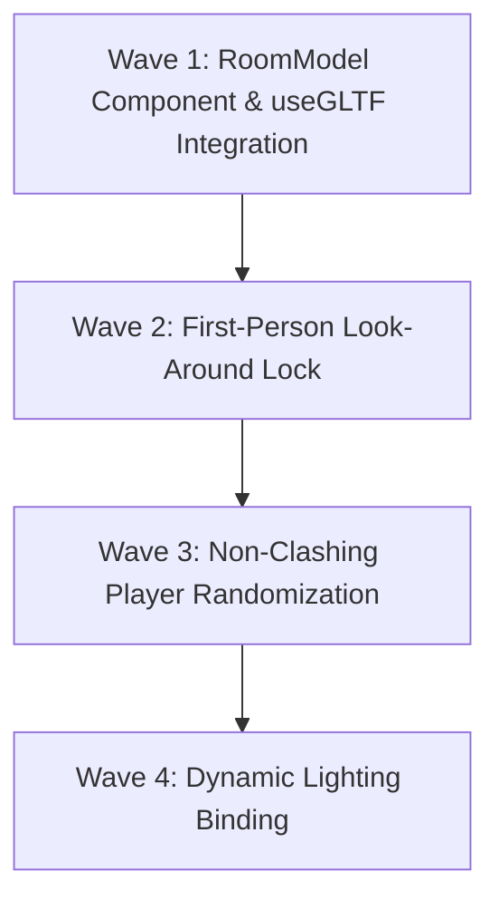

# Phase 1 Plan: Dynamic 3D Model Visor

This plan outlines the steps to replace the abstract `RoomCube` box with high-immersion, look-around 3D GLB room environments, including safe non-clashing player positioning and dynamic day/night light bindings.

---

## Proposed Plan



---

## Wave 1: RoomModel Component & useGLTF Integration
**Goal:** Create a high-performance 3D loading component and integrate it into the room exploration flow.

### Tasks

<task id="1.1" autonomous="true">
<read_first>
- src/features/exploration/components/RoomCube.tsx
</read_first>
<action>
Crear el componente `RoomModel.tsx` en `src/features/exploration/components/RoomModel.tsx`. El componente debe:
1. Importar `useGLTF` desde `@react-three/drei`.
2. Tomar las props: `url: string`, `scale?: number`, `position?: [number, number, number]`, `rotation?: [number, number, number]`.
3. Cargar la escena utilizando `const { scene } = useGLTF(url);`.
4. Utilizar `scene.traverse` para recorrer todas las mallas (`THREE.Mesh`) y configurar `child.castShadow = true`, `child.receiveShadow = true` para activar sombras tridimensionales realistas en toda la geometría de la habitación.
5. Retornar el objeto cargado como un elemento `<primitive object={scene} scale={scale} position={position} rotation={rotation} />`.
</action>
<acceptance_criteria>
- El archivo `src/features/exploration/components/RoomModel.tsx` existe.
- El archivo importa `useGLTF` desde `@react-three/drei`.
- Implementa `scene.traverse` y activa `castShadow` y `receiveShadow` en cada malla.
- Exporta correctamente la función `RoomModel`.
</acceptance_criteria>
</task>

<task id="1.2" autonomous="true">
<read_first>
- src/features/exploration/components/RoomCube.tsx
</read_first>
<action>
Modificar `RoomCube.tsx` para integrar de forma asíncrona el componente `<RoomModel />`:
1. Importar `Suspense` desde `react` y `RoomModel` desde `./RoomModel`.
2. Crear un mapa local temporal de prueba en el componente que asocie IDs de sala (`roomId`) con rutas locales a modelos GLB (ej. `/models/sala_crimen.glb` para el ID del cuarto de coordinación). Esto nos permitirá testear localmente en la Fase 1 antes de conectar el esquema Supabase completo en la Fase 2.
3. Si el ID de sala activa tiene un modelo asociado en el mapa, renderizar `<RoomModel url={url} scale={1} position={[0, 0, 0]} />` dentro de un `<Suspense fallback={<FallbackLoadingBox />} />`.
4. Si no tiene modelo, retornar el fallback clásico (la caja de malla `<boxGeometry>` con el material interior actual y el grid helper) para garantizar un fallback seguro.
</action>
<acceptance_criteria>
- `RoomCube.tsx` importa e integra el componente `RoomModel`.
- Renderiza el escenario usando `Suspense` si existe modelo local mapeado.
- Mantiene el fallback de caja clásica (`RoomCube` original) si no hay modelo, garantizando cero roturas.
</acceptance_criteria>
</task>

---

## Wave 2: First-Person Look-Around Lock
**Goal:** Bloquear la cámara para crear un visor inmersivo de primera persona de look-around.

### Tasks

<task id="2.1" autonomous="true">
<read_first>
- src/features/exploration/components/InsideRoomArena.tsx
</read_first>
<action>
Modificar la configuración de cámara y controles en `src/features/exploration/components/InsideRoomArena.tsx`:
1. Localizar el componente `<Canvas>` y establecer su propiedad de cámara inicial `camera={{ position: [0, 1.5, 0.1], fov: 60 }}` (el centro es `[0, 1.5, 0]`, el ligero offset de `0.1` en Z es necesario para que el vector de rotación funcione correctamente).
2. Localizar el componente `<OrbitControls>` e inhabilitar por completo el zoom y el desplazamiento configurando `enableZoom={false}` y `enablePan={false}`.
3. Asegurar que el `target` de `OrbitControls` esté rígidamente fijado en `[0, 1.5, 0]` para forzar al jugador a actuar como la cámara mirada, rotando en su propio eje.
</action>
<acceptance_criteria>
- `InsideRoomArena.tsx` configura el `<Canvas>` con cámara centrada en `[0, 1.5, 0.1]`.
- `<OrbitControls>` tiene `enableZoom={false}`, `enablePan={false}` y `target={[0, 1.5, 0]}`.
</acceptance_criteria>
</task>

---

## Wave 3: Non-Clashing Player Randomization
**Goal:** Implementar el algoritmo de posicionamiento de avatares evitando solapamiento con evidencias del mapa.

### Tasks

<task id="3.1" autonomous="true">
<read_first>
- src/features/exploration/components/InsideRoomArena.tsx
</read_first>
<action>
Refactorizar el algoritmo de posicionamiento de otros jugadores en `InsideRoomArena.tsx`:
1. Localizar la función `getPositionForIndex`.
2. Cambiar la lógica para generar coordenadas `[x, 0, z]` aleatorizadas en base al index.
3. Implementar un bucle de comprobación de proximidad a las evidencias activas (`clues`):
   - Por cada coordenada generada, calcular la distancia euclidiana tridimensional respecto a todas las coordenadas absolutas de las pistas en `clues` (ej. `Math.sqrt(Math.pow(x - clue.pos_x, 2) + Math.pow(z - clue.pos_z, 2))`).
   - Si la distancia es menor a `2.0` unidades (umbral de colisión visual), recalcular la posición o desplazar las coordenadas generadas para apartarlo de la pista.
4. Validar que la posición devuelta garantice que los avatares nunca impidan el clic o la selección visual del `EvidenceSprite3D` correspondiente.
</action>
<acceptance_criteria>
- `InsideRoomArena.tsx` implementa validación geométrica en `getPositionForIndex`.
- Comprueba distancias a `clues` y evita solapamientos de menos de 2.0 unidades.
</acceptance_criteria>
</task>

---

## Wave 4: Dynamic Lighting Binding
**Goal:** Vincular las luces de la sala reactivamente al ciclo de tiempo activo (Día/Noche).

### Tasks

<task id="4.1" autonomous="true">
<read_first>
- src/features/exploration/components/InsideRoomArena.tsx
</read_first>
<action>
Modificar las luces de la sala en `InsideRoomArena.tsx`:
1. Asegurar que las luces `<ambientLight>` y `<pointLight>` en el Canvas lean sus propiedades de color e intensidad de variables reactivas vinculadas al estado de la partida (`isNight` o `gamePeriod` proveniente de `useTmaStore`).
2. Configurar la iluminación según el ciclo activo:
   - **Ciclo Día**: `<ambientLight intensity={0.7} color="#ffffff" />` y `<pointLight intensity={1.0} color="#aaccff" />`.
   - **Ciclo Noche**: `<ambientLight intensity={0.3} color="#ff3333" />` (rojo tenue inmersivo) y `<pointLight intensity={0.5} color="#ff3333" />`.
3. Habilitar la propiedad `castShadow` en el `<pointLight />` para proyectar sombras de alta fidelidad en los avatares y elementos 3D.
</action>
<acceptance_criteria>
- `InsideRoomArena.tsx` vincula la intensidad y color de las luces de forma reactiva al periodo nocturno/diurno.
- `<pointLight>` incluye el parámetro `castShadow`.
</acceptance_criteria>
</task>

---

## Verification Plan

### Automated Build Checks
* Run TypeScript compiler to ensure clean types:
  ```bash
  npm run typecheck
  ```
* Run Next.js linting to avoid structural code issues:
  ```bash
  npm run lint
  ```

### Manual Verification
1. Colocar un archivo de modelo 3D GLB temporal en `/public/models/sala_crimen.glb`.
2. Acceder como estudiante al cuarto de coordinación.
3. Confirmar que el escenario 3D carga mediante Suspense y dibuja el modelo en lugar del cubo básico.
4. Validar que el ratón o control táctil rota la cámara look-around en 360 grados, pero el zoom y el pan lateral están bloqueados.
5. Cargar un segundo jugador en incógnito y confirmar que su avatar 2D se posiciona aleatoriamente en el suelo sin solaparse ni bloquear las evidencias interactivas flotantes.
6. Cambiar el periodo de juego a noche y comprobar que la iluminación del visor 3D se atenúa y tiñe a rojo inmersivo de inmediato de manera reactiva.
