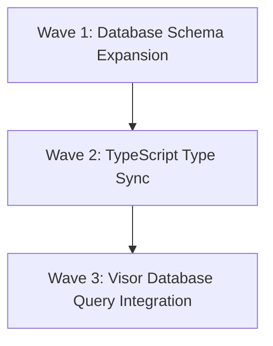

# Phase 2 Plan: Relational Schema & Storage

This plan outlines the steps to extend our database schema in Supabase to support room-specific 3D models with proportions and heights, synchronize TypeScript typings manually, and integrate the dynamic visor with PostgreSQL fields.

---

## Proposed Plan



---

## Wave 1: Database Schema Expansion
**Goal:** Extend the PostgreSQL schema with rooms modeling parameters and seed them with default local models.

### Tasks

<task id="1.1" autonomous="true">
<read_first>
- supabase_migrations_tma_v2.sql
- db_tma_update.sql
</read_first>
<action>
Crear el archivo de migración SQL `supabase_migrations_tma_v5_models.sql` en la raíz del proyecto. El script debe:
1. Agregar las siguientes columnas de forma segura a la tabla `public.tma_rooms` si no existen:
   - `model_url` tipo `text` (permite valores nulos/vacíos).
   - `model_scale` tipo `numeric` o `double precision` con valor predeterminado `1.0`.
   - `model_offset_y` tipo `numeric` o `double precision` con valor predeterminado `0.0`.
2. Incluir sentencias `UPDATE` para semillar las salas por defecto existentes (`COORDINACIÓN DE ASESINATO`, etc.) con sus correspondientes modelos GLB locales de prueba creados en la Fase 1 (`coordinacion.glb`, `biblioteca.glb`, `test_room.glb`).
</action>
<acceptance_criteria>
- El archivo `supabase_migrations_tma_v5_models.sql` existe en la raíz del proyecto.
- Contiene sentencias `ALTER TABLE public.tma_rooms ADD COLUMN IF NOT EXISTS` para `model_url`, `model_scale` y `model_offset_y`.
- Contiene la sentencia de actualización `UPDATE public.tma_rooms` vinculando las salas de desarrollo existentes con sus respectivos nombres de archivo GLB locales.
</acceptance_criteria>
</task>

---

## Wave 2: TypeScript Type Sync
**Goal:** Synchronize and extend TypeScript type definitions manually across all schema definitions.

### Tasks

<task id="2.1" autonomous="true">
<read_first>
- database.types_readable.ts
</read_first>
<action>
Modificar de forma manual los archivos de definición de tipos TypeScript de la base de datos:
1. Localizar la interfaz de `tma_rooms` en `database.types_readable.ts`, `database.types.utf8.ts` y el principal `database.types.ts`.
2. Añadir en las propiedades de `Row`, `Insert` y `Update`:
   - `model_url: string | null` (en `Insert` y `Update` opcional `model_url?: string | null`).
   - `model_scale: number` (en `Insert` y `Update` opcional `model_scale?: number`).
   - `model_offset_y: number` (en `Insert` y `Update` opcional `model_offset_y?: number`).
3. Asegurar que las interfaces de tipo coincidan exactamente con la firma de datos de base de datos para no arrojar errores de compilación estática.
</action>
<acceptance_criteria>
- Los archivos `database.types.ts`, `database.types_readable.ts` y `database.types.utf8.ts` contienen la definición de `tma_rooms` con los campos `model_url`, `model_scale` y `model_offset_y` en sus respectivas propiedades de Row, Insert y Update.
- Los tipos están correctamente importados y no hay errores de sintaxis en TypeScript.
</acceptance_criteria>
</task>

---

## Wave 3: Visor Database Query Integration
**Goal:** Refactor the visor background renderer to fetch and load properties directly from the database.

### Tasks

<task id="3.1" autonomous="true">
<read_first>
- src/features/exploration/components/RoomCube.tsx
</read_first>
<action>
Modificar `RoomCube.tsx` en `src/features/exploration/components/RoomCube.tsx` para integrar las consultas dinámicas a la base de datos Supabase:
1. Eliminar el mapa estático temporal local `LOCAL_MODEL_MAP` y las declaraciones sincrónicas asociadas.
2. Importar `useState`, `useEffect` desde `react` y `createClient` desde `@/lib/supabase/client`.
3. Crear un estado local reactivo `modelConfig` para alojar los parámetros del modelo cargado de forma dinámica:
   - `url: string | null`
   - `scale: number`
   - `position: [number, number, number]`
4. Implementar un hook `useEffect` con dependencia en `roomId` que:
   - Cree una instancia cliente de Supabase (`createClient()`).
   - Realice una consulta asíncrona a la tabla `tma_rooms` filtrando por `id` igual a `roomId` y seleccionando `model_url, model_scale, model_offset_y`.
   - En el callback asíncrono, si se encuentran datos válidos y `model_url` no es nulo, setear `modelConfig` anteponiendo el directorio local público `/models/` si es necesario (ej: `/models/coordinacion.glb`).
   - Si no hay modelo para la sala, setear `modelConfig` en `null`.
5. Si `modelConfig` tiene una URL asignada, renderizar `<RoomModel url={modelConfig.url} scale={modelConfig.scale} position={modelConfig.position} />` dentro del Suspense boundary.
6. Si no hay modelo, renderizar el cubo de rejilla clásico como fallback seguro.
</action>
<acceptance_criteria>
- `RoomCube.tsx` realiza la consulta dinámica asíncrona a `tma_rooms` vía Supabase Client.
- Resuelve correctamente los campos `model_url`, `model_scale` y `model_offset_y`.
- Renderiza el fallback del cubo clásico si la base de datos no reporta un modelo válido para la sala.
- No produce warnings o errores de ESLint (`react-hooks/set-state-in-effect` se cumple ya que el set de estado ocurre dentro de una resolución asíncrona).
</acceptance_criteria>
</task>

---

## Verification Plan

### Automated Build Checks
* Run TypeScript compiler to verify type safety:
  ```bash
  npm run typecheck
  ```
* Run ESLint validation:
  ```bash
  npx eslint src
  ```

### Manual Verification
1. Aplicar la migración SQL directamente en Supabase o verificar que el archivo de migración `supabase_migrations_tma_v5_models.sql` sea perfectamente válido y sintáctico.
2. Acceder como estudiante al cuarto de coordinación.
3. Confirmar que la aplicación realiza la petición HTTP a la base de datos Supabase, devuelve el `model_url = coordinacion.glb`, y carga dinámicamente el modelo GLB local con la escala y posición Y adecuadas.
4. Cambiar a una sala que no tenga modelo registrado (ej. Lobby Principal o Baños) y verificar que se dibuja el fallback del cubo de rejilla con la iluminación ambiental normal, sin romper la VN o los chats.
